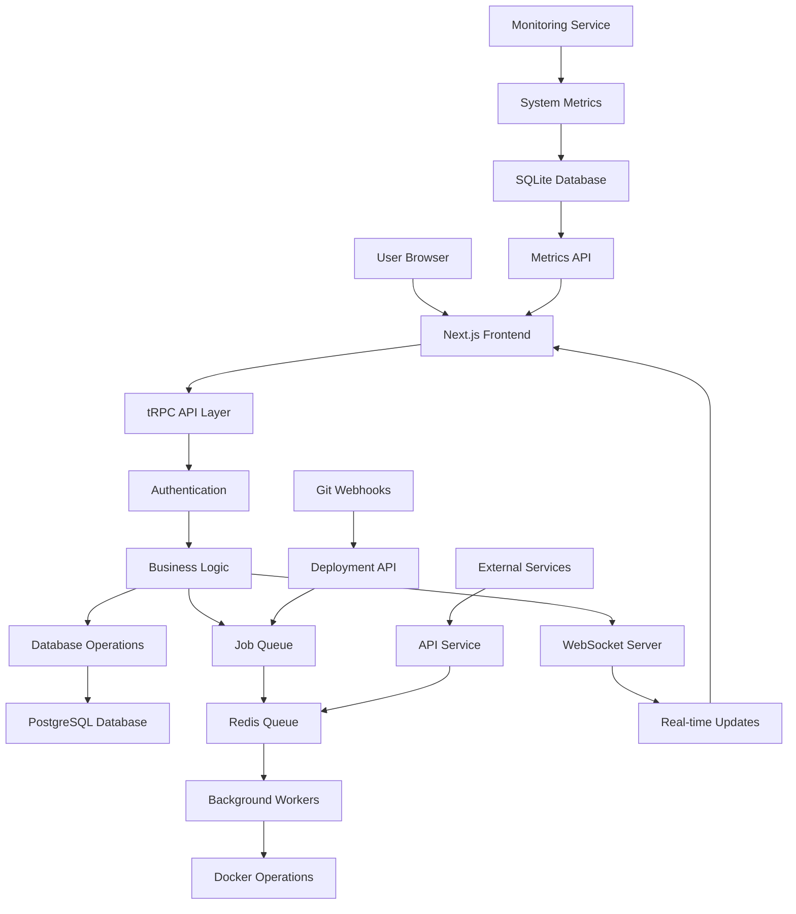

# Dokploy System Architecture Overview

**Last updated:** January 15, 2025

## System Overview

Dokploy is a self-hostable Platform as a Service (PaaS) that simplifies application deployment and management. Think of it as your own personal "Heroku" or "Vercel" that you can run on your own servers. The system follows a **microservices architecture** with multiple specialized applications working together to provide a complete deployment platform.

The architecture is built around a **monorepo structure** using pnpm workspaces, where different applications handle specific responsibilities like the main web interface, API services, monitoring, and scheduled tasks. This modular approach allows each component to be developed, deployed, and scaled independently while sharing common code through shared packages.

**Core Benefits for Beginners:**
- **Self-hosted control**: Deploy and manage your own applications without relying on external services
- **Docker-based**: Uses containerization for consistent deployments across different environments
- **Real-time monitoring**: Built-in system and application performance tracking
- **Git integration**: Automatic deployments from GitHub, GitLab, and other Git providers
- **Multi-language support**: Deploy applications written in Node.js, Python, Go, PHP, and more

## Key Terms

| Term | Simple Explanation |
|------|-------------------|
| **PaaS** | Platform as a Service - A cloud computing model that provides a platform for developing, running, and managing applications |
| **Microservices** | An architectural approach where applications are built as a collection of loosely coupled services |
| **Docker** | A containerization platform that packages applications and their dependencies into lightweight, portable containers |
| **tRPC** | A TypeScript-first API framework that provides end-to-end type safety between frontend and backend |
| **WebSocket** | A communication protocol that enables real-time, bidirectional communication between client and server |
| **Redis** | An in-memory data store used for caching, session storage, and job queues |
| **PostgreSQL** | A powerful, open-source relational database system used for storing application data |

## Directory Tree

```
dokploy/
├── apps/                          # Main applications
│   ├── dokploy/                   # Main web application (Next.js)
│   │   ├── components/            # React UI components
│   │   ├── pages/                 # Next.js pages and API routes
│   │   ├── server/                # Backend logic and API
│   │   └── __test__/              # Test files
│   ├── api/                       # Standalone API service
│   ├── monitoring/                # System monitoring service (Go)
│   └── schedules/                 # Background job scheduler
├── packages/                      # Shared code packages
│   └── server/                    # Shared server utilities and database
└── specs/                         # Documentation and specifications
```

## Component Breakdown

### 1. Main Web Application (`apps/dokploy`)
- **Technology**: Next.js (React), TypeScript, tRPC
- **Role**: Primary user interface and API server
- **Key Features**: 
  - User authentication and authorization
  - Application deployment management
  - Real-time monitoring dashboard
  - Docker container management
- **Dependencies**: PostgreSQL, Redis, Docker

### 2. API Service (`apps/api`)
- **Technology**: Hono (TypeScript), Redis
- **Role**: Standalone API service for external integrations
- **Key Features**:
  - RESTful API endpoints
  - External service integrations
  - Queue management
- **Dependencies**: Redis, shared server package

### 3. Monitoring Service (`apps/monitoring`)
- **Technology**: Go, SQLite
- **Role**: System and container performance monitoring
- **Key Features**:
  - CPU, memory, and disk usage tracking
  - Docker container metrics
  - Performance alerts
- **Dependencies**: Docker, system APIs

### 4. Scheduler Service (`apps/schedules`)
- **Technology**: TypeScript, BullMQ, Redis
- **Role**: Background job processing and task scheduling
- **Key Features**:
  - Automated backups
  - Cleanup tasks
  - Scheduled deployments
- **Dependencies**: Redis, shared server package

### 5. Shared Server Package (`packages/server`)
- **Technology**: TypeScript, Drizzle ORM, PostgreSQL
- **Role**: Common utilities and database operations
- **Key Features**:
  - Database schema and migrations
  - Authentication logic
  - Docker operations
  - Utility functions
- **Dependencies**: PostgreSQL, Docker

## Data Flow Diagram



## Typical Data/Control Flow

1. **User Authentication**: User logs in through the web interface, which validates credentials against the database and creates a session
2. **Application Deployment**: User creates a new application, system validates configuration, creates deployment job in Redis queue
3. **Background Processing**: Worker picks up deployment job, pulls code from Git repository, builds Docker container, deploys to server
4. **Real-time Updates**: WebSocket connections provide live deployment logs and status updates to the user interface
5. **Monitoring**: Monitoring service collects system metrics, stores them in SQLite, and exposes them via API for dashboard display
6. **Git Integration**: Webhook from Git provider triggers automatic deployment when code is pushed to repository

## Learning Tips

- **Start with the main application**: Begin exploring `apps/dokploy` to understand the core functionality and user interface
- **Follow the data flow**: Trace how user actions flow through the system from frontend to database and back
- **Examine the database schema**: Look at `packages/server/src/db/schema` to understand the data model and relationships
- **Study the deployment process**: Check `apps/dokploy/server/queues` to see how background jobs handle deployments
- **Explore the monitoring system**: Review `apps/monitoring` to understand how system metrics are collected and displayed

## Exploration Questions

- **How does the system handle different types of applications?** Look at the various deployment strategies for different programming languages and frameworks
- **What happens when a deployment fails?** Examine error handling, logging, and recovery mechanisms in the deployment pipeline
- **How does the system scale to multiple servers?** Investigate the multi-server deployment capabilities and load balancing features
- **How are security and permissions managed?** Study the authentication system, user roles, and access control mechanisms
- **What monitoring and alerting capabilities exist?** Explore the metrics collection, threshold configuration, and notification systems

---

*This overview provides a foundation for understanding Dokploy's architecture. For deeper technical details, explore the specific components and their implementations.*