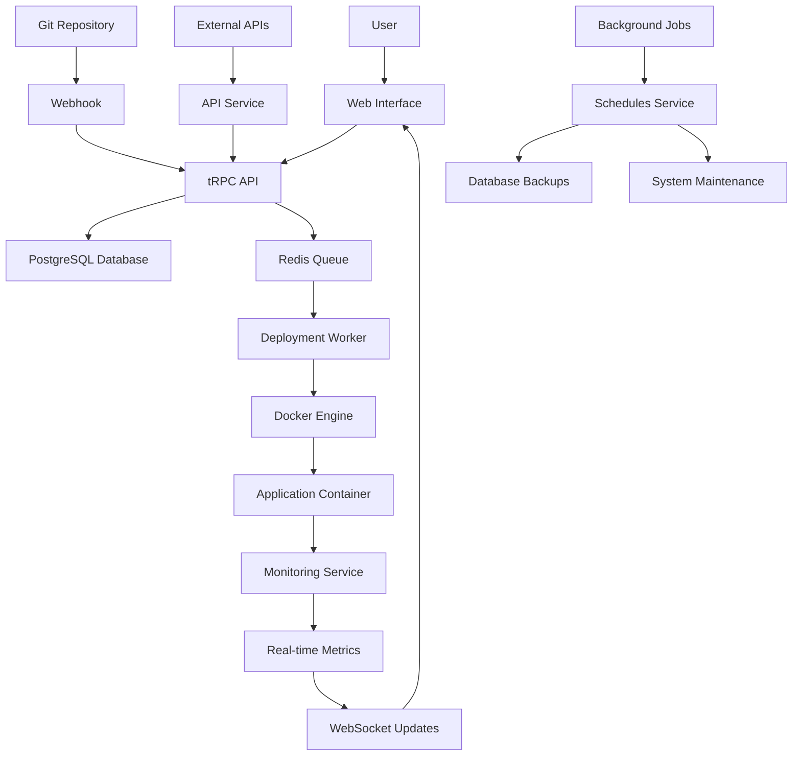

# Dokploy System Architecture Overview

**Last updated:** January 19, 2025

## System Overview

Dokploy is a self-hostable Platform as a Service (PaaS) that simplifies application deployment and management. Think of it as your own personal "Heroku" or "Vercel" that you can run on your own servers. The system follows a **microservices architecture** with multiple specialized applications working together to provide a complete deployment platform.

The architecture is built around a **monorepo structure** using pnpm workspaces, where different applications handle specific responsibilities like the main web interface, API services, monitoring, and scheduled tasks. This modular approach allows each component to be developed, deployed, and scaled independently while sharing common code through shared packages.

**Core Benefits for Beginners:**
- **Self-hosted control**: Deploy and manage your own applications without relying on external services
- **Docker-based**: Uses containerization for consistent deployments across different environments
- **Real-time monitoring**: Built-in system and application performance tracking
- **Git integration**: Automatic deployments from GitHub, GitLab, and other Git providers
- **Multi-language support**: Deploy applications written in Node.js, Python, Go, PHP, and more

## Key Terms

| Term | Simple Explanation |
|------|-------------------|
| **PaaS** | Platform as a Service - A cloud computing model that provides a platform for developing, running, and managing applications |
| **Microservices** | An architectural approach where applications are built as a collection of loosely coupled services |
| **Docker** | A containerization platform that packages applications and their dependencies into lightweight, portable containers |
| **tRPC** | A TypeScript-first API framework that provides end-to-end type safety between frontend and backend |
| **WebSocket** | A communication protocol that enables real-time, bidirectional communication between client and server |
| **Redis** | An in-memory data store used for caching, session storage, and job queues |
| **PostgreSQL** | A powerful, open-source relational database system used for storing application data |

## Directory Tree

```
dokploy/
├── apps/                          # Main applications
│   ├── dokploy/                   # Main web application (Next.js)
│   │   ├── components/            # React UI components
│   │   ├── pages/                 # Next.js pages and API routes
│   │   ├── server/                # Backend logic and API
│   │   └── __test__/              # Test files
│   ├── api/                       # Standalone API service
│   ├── monitoring/                # System monitoring service (Go)
│   └── schedules/                 # Background job scheduler
├── packages/                      # Shared code packages
│   └── server/                    # Shared server utilities and database
└── specs/                         # Documentation and specifications
```

## Component Breakdown

### 1. Main Web Application (`apps/dokploy`)
- **Technology**: Next.js (React), TypeScript, tRPC
- **Role**: Primary user interface and API server
- **Key Features**: 
  - User authentication and authorization
  - Application deployment management
  - Real-time monitoring dashboard
  - Docker container management
- **Dependencies**: PostgreSQL, Redis, Docker

### 2. API Service (`apps/api`)
- **Technology**: Hono (TypeScript), Redis
- **Role**: Standalone API service for external integrations
- **Key Features**:
  - RESTful API endpoints
  - External service integrations
  - Queue management
- **Dependencies**: Redis, shared server package

### 3. Monitoring Service (`apps/monitoring`)
- **Technology**: Go, SQLite
- **Role**: System and container performance monitoring
- **Key Features**:
  - CPU, memory, disk, and network monitoring
  - Docker container metrics collection
  - Alert system for resource thresholds
- **Dependencies**: Docker API, system metrics libraries

### 4. Schedules Service (`apps/schedules`)
- **Technology**: TypeScript, BullMQ, Redis
- **Role**: Background job processing and task scheduling
- **Key Features**:
  - Cron job management
  - Database backup scheduling
  - Automated maintenance tasks
- **Dependencies**: Redis, shared server package

### 5. Shared Server Package (`packages/server`)
- **Technology**: TypeScript, Drizzle ORM, PostgreSQL
- **Role**: Common business logic and database operations
- **Key Features**:
  - Database schema and migrations
  - Authentication and authorization
  - Docker container management utilities
  - Email and notification services
- **Dependencies**: PostgreSQL, Docker, various external APIs

## Data / Control Flow

A typical deployment flow in Dokploy works like this:

1. **User Input**: User creates a new application through the web interface
2. **API Processing**: The main application receives the request via tRPC
3. **Database Storage**: Application configuration is saved to PostgreSQL
4. **Queue Job**: A deployment job is added to the Redis queue
5. **Worker Processing**: The deployment worker picks up the job and executes it
6. **Docker Operations**: The system builds and deploys the application using Docker
7. **Monitoring**: The monitoring service tracks the new container's performance
8. **Real-time Updates**: WebSocket connections provide live deployment logs to the user

## Visual Flowchart



## Learning Tips

- **Start with the main application**: Begin exploring `apps/dokploy` to understand the core functionality
- **Follow the data flow**: Trace how a deployment request moves through the system from UI to Docker
- **Use the test files**: Check out `__test__` directories to understand expected behavior
- **Explore the database schema**: Look at `packages/server/src/db/schema` to understand data relationships
- **Check the monitoring endpoints**: The Go monitoring service has clear REST endpoints for understanding system metrics

## Exploration Questions

- How does Dokploy handle different types of applications (Node.js, Python, Go, etc.)?
- What happens when a deployment fails, and how does the system recover?
- How does the monitoring service collect and store performance metrics?
- What security measures are in place to protect deployed applications?
- How does the system handle scaling applications across multiple servers?

---

*This overview provides a foundation for understanding Dokploy's architecture. For deeper technical details, explore the specific components and their implementation files.*
