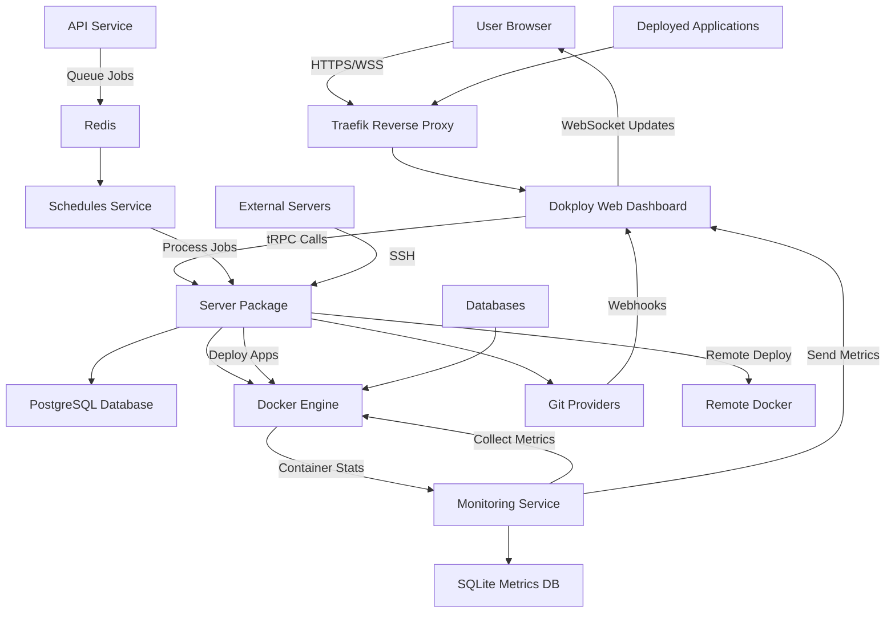

# Dokploy System Architecture Overview

**Last updated:** September 29, 2025

## System Overview

Dokploy is a free, self-hostable Platform as a Service (PaaS) that simplifies the deployment and management of applications and databases. Think of it as your own personal Vercel or Heroku that you can run on your own servers. The system follows a modular microservices architecture with a central web dashboard, supporting services for monitoring and scheduling, and a shared server package that contains all the core business logic.

The platform is built using modern web technologies with Next.js for the frontend, tRPC for type-safe APIs, PostgreSQL for data persistence, and Docker Swarm for container orchestration. It integrates seamlessly with Git providers (GitHub, GitLab, Bitbucket) for automated deployments and uses Traefik as a reverse proxy for routing and SSL certificate management.

## Directory Tree

```
dokploy/
├── apps/                          # Individual applications
│   ├── dokploy/                   # Main web dashboard (Next.js)
│   │   ├── components/            # React components
│   │   ├── pages/                 # Next.js pages and API routes
│   │   ├── server/                # Server-side logic and tRPC routers
│   │   └── public/                # Static assets
│   ├── api/                       # Standalone API service (Hono)
│   ├── monitoring/                # System monitoring service (Go)
│   └── schedules/                 # Background job scheduler (Node.js)
├── packages/
│   └── server/                    # Shared business logic package
│       ├── src/db/                # Database schemas and migrations
│       ├── src/services/          # Core business services
│       ├── src/utils/             # Utility functions and builders
│       └── src/setup/             # System initialization
└── specs/                         # Documentation and specifications
```

## Component Breakdown

| Component | Role | Technology | Key Dependencies |
|-----------|------|------------|------------------|
| **Dokploy Web App** | Main dashboard for managing applications, databases, and deployments | Next.js, React, tRPC | `@dokploy/server`, PostgreSQL, Traefik |
| **API Service** | Standalone API for programmatic access | Hono, Node.js | `@dokploy/server`, Redis, BullMQ |
| **Monitoring Service** | Real-time system and container metrics collection | Go, Fiber | SQLite, Docker API |
| **Schedules Service** | Background job processing and scheduled tasks | Node.js, BullMQ | `@dokploy/server`, Redis, PostgreSQL |
| **Server Package** | Shared business logic, database models, and utilities | TypeScript, Drizzle ORM | PostgreSQL, Docker, SSH2 |

## Data Flow Diagram



## Learning Tips

- **Start with the main dashboard**: Begin exploring in `apps/dokploy/pages` to understand the user interface structure and navigation flow.

- **Follow the data**: Trace how data flows from the UI components through tRPC routers in `apps/dokploy/server/api/routers` to the business logic in `packages/server/src`.

- **Understand the deployment process**: Look at `packages/server/src/utils/builders` to see how different application types (Dockerfile, Nixpacks, etc.) are built and deployed.

- **Explore database schemas**: Check `packages/server/src/db/schema` to understand the data models for applications, databases, projects, and deployments.

- **Study the Docker integration**: Examine `packages/server/src/utils/docker` to see how the system orchestrates containers using Docker Swarm.

## Exploration Questions

- **How does Dokploy handle different deployment strategies?** Investigate the builders in `packages/server/src/utils/builders` to understand support for Dockerfile, Nixpacks, Heroku buildpacks, and static sites.

- **What makes the system multi-tenant and scalable?** Explore the project and organization models in the database schema and see how applications are isolated using Docker networks.

- **How does the real-time monitoring work?** Trace the flow from the Go monitoring service through WebSocket connections to the dashboard's real-time charts and metrics display.
